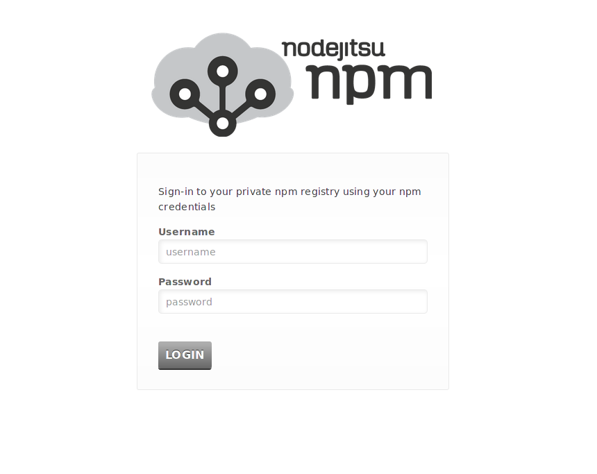
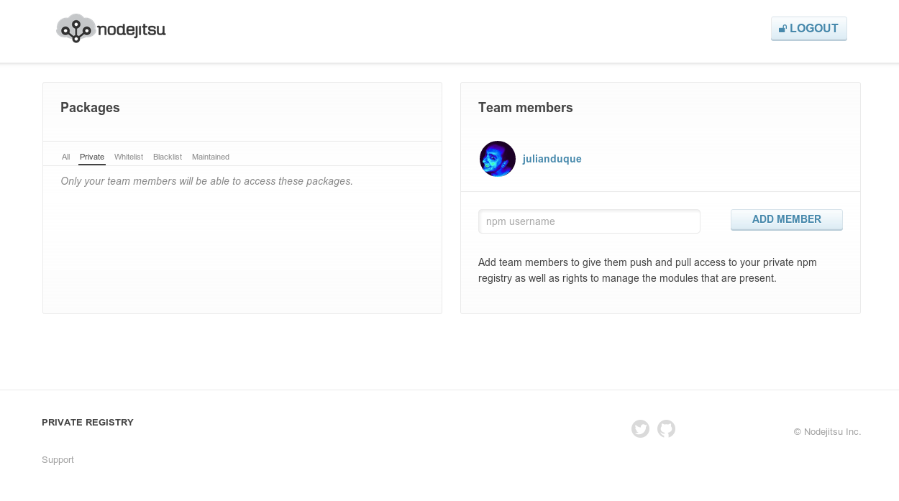
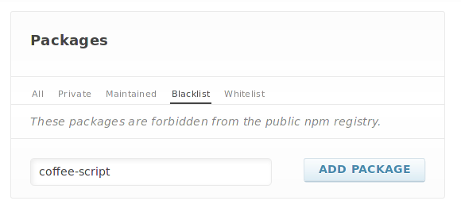
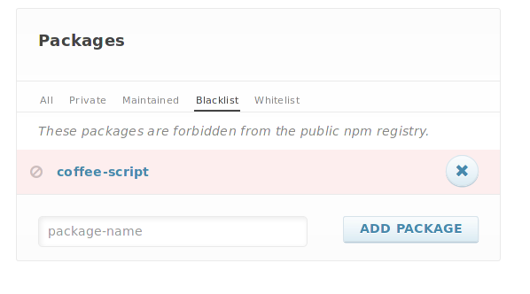
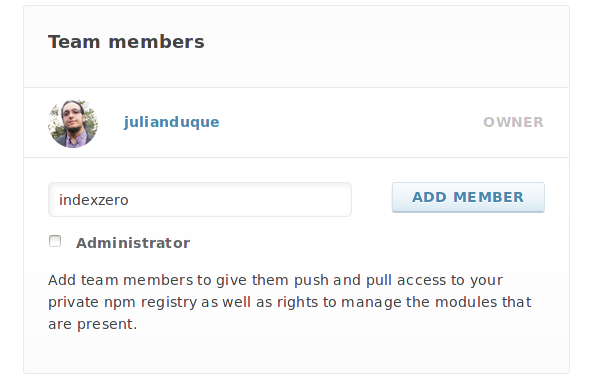
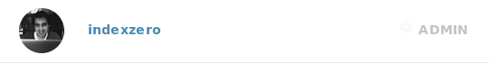
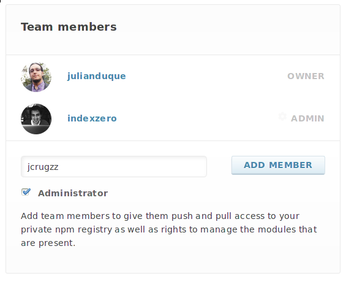
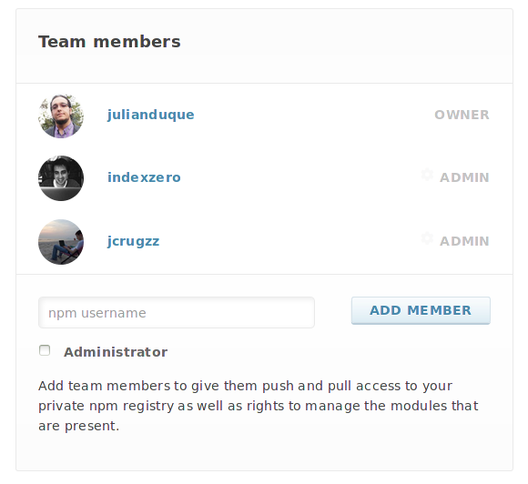
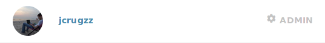

# Hosted Private npm - Web Interface

* [Package Management](#package-management)
* [User Management](#user-management)

You can login to your Web Interface in `http://your-subdomain.npm.nodejitsu.com` with your `npm` credentials.

## Dashboard

## Package Management

### Private
Lists the private packages published to your npm, these are only visible by your team members and are always proxied to your private CouchDB server.

### Maintained
All the packages maintained by your team members.

### Blacklist
These packages are explicitly forbidden to be retrieved from the public npm registry.

#### Add Package to Blacklist
If you want to Blacklist a package just write down the package name and click on `Add Package`.

#### Remove Package from Blacklist
To remove a package from Blacklist just click on the `(x)` button right to the package name.

### Whitelist
Only these packages (and all private npm packages) will be permitted from the public npm registry. *It is possible for a package to be both private and blacklisted. This is how you can take ownership over a given module.*

*Admin Whitelist packages works the same as Blacklist.*

## User Management

### Add member
Just write down the public npm username and click on `Add member`.

### Remove member
To remove a user from your team, click on the settings icon.

A settings panel will appear, then click on the `Delete` button and it's done.

### Add Administrator
You can add an Administrator by clicking on the `Add Admin` button on the user settings panel shown above.

Or by checking the `Administrator` property when adding a new member to your team.

Now you can see the new added member with `Admin` role.

### Remove Administrator
If you want to remove the `Admin` role just click on the user settings icon.

And then click on the `Remove Admin` button.

Thats how you admin your team members, easy right?

[meta:title]: <> (Web Interface)
