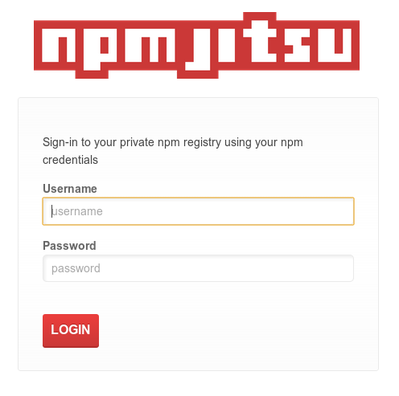
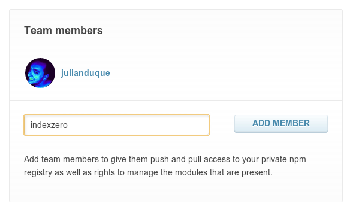
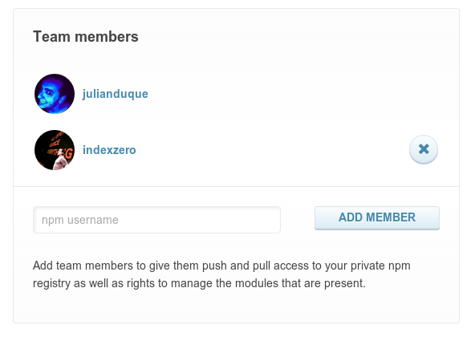

# Web Interface

You can login to your Web Interface in `http://your-subdomain.npm.nodejitsu.com` with your `npm` credentials.

## Dashboard

## Packages Policy

### Private
Lists the private packages published to your npm, these are only visible by your team members and are always proxied to your private CouchDB server.

### Whitelist
Only these packages (and all private npm packages) will be permitted from the public npm registry. *It is possible for a package to be both private and blacklisted. This is how you can take ownership over a given module.*

### Blacklist
These packages are explicitly forbidden to be retrieved from the public npm registry.

### Maintained
All the packages maintained by your team members.

## Team Members

### Add member

Just write down the public npm username and click on `Add member`.

### Remove member
To remove a user from your team, click on the `(x)` button right their username.

[meta:title]: <> (Web Interface)
